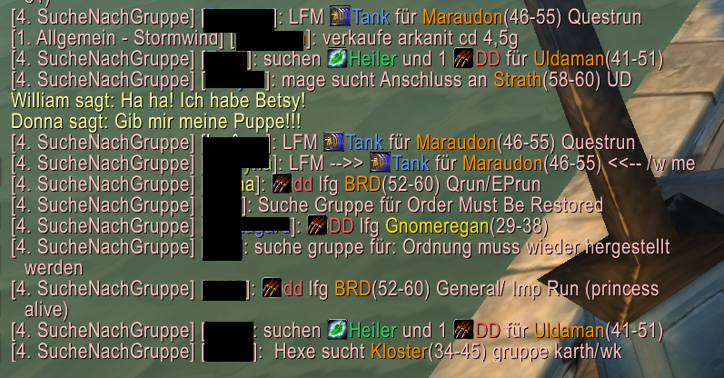

# ChatPainter
This is a addon for WoW Classic.

It highlights Instance names and Rolls in LFG chat channels. 
Trigger words are tuned for a german community, so if you want to use an other language you may have to modify it.

! Waring
There are no options atm.

## Features
- Color Rollnames and add Icons
- Color Instance Names and add the level range of the Instance
- Notify you (sound) if a instance in your level range is mentioned

### Known Issues
 - Notifications only if your roll is mentioned is buggy
